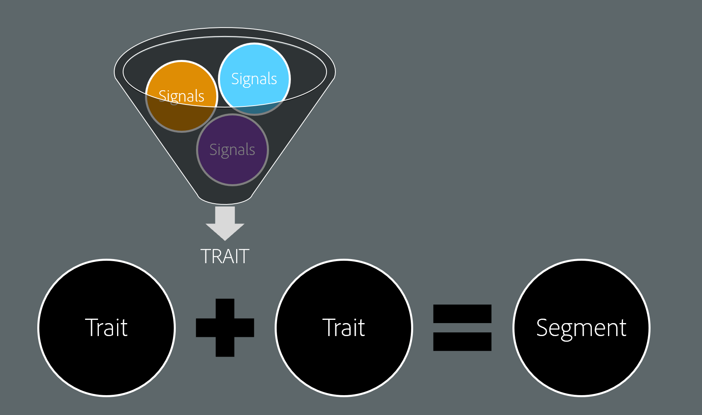
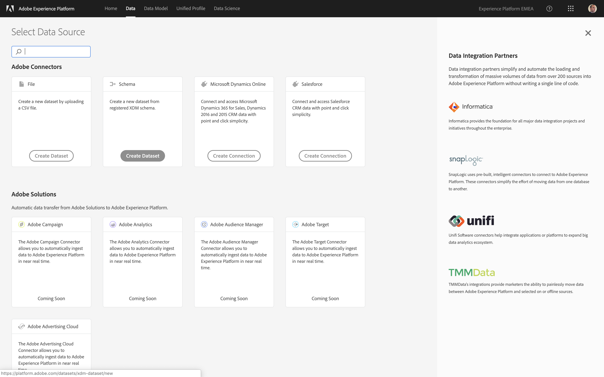
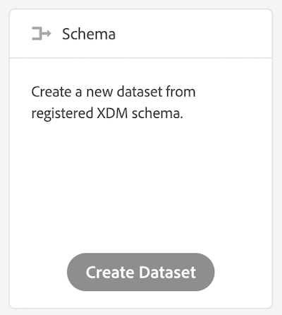

## Exercise 2: Build Traits & Segments
In this exercise, the goal is to define traits in AAM and assign them to a Segment.

### Learning Objectives

- Learn how to create a trait based on key:value pairs
- Learn the web UI of Adobe Audience Manager (Trait and Segment Builder)
- Understand the importance of a self-manageable taxonomy
- Learn how to build a segment based on boolean operators (AND/OR/NOT)
- Learn how to activate a segment to a destination (targeting platform)

### Lab Resources

- Experience Cloud UI: [https://experiencecloud.adobe.com/](https://experiencecloud.adobe.com/)

### Lab Tasks

- Creating traits and segments
- Activating a segment to a destination

### Story: Using the Data Ingestion UI

In Exercise 1 you have completed the neccessary steps to start collecting online behavioral data via Adobe Analytics which is being server-side-forwarded into Adobe Audience Manager. Now we've got raw data (key:value pairs such as evar1:pageName) flowing into the Data Management Platform. In AAM such raw data is called a **Signal**. The goal is to have users qualify for a segment, so we need to take the raw data flowing into the DMP and bring it into a format which the DMP can read. This format or attribute is called a **Trait**. Traits are built from signals based on the key:value pairs. 

### Exercise 2.1 - Create a trait based on key:value pairs

Open the [Experience Cloud UI](https://experiencecloud.adobe.com) and log in with the details provided to you. 

Let's create a new trait. Click "Audience Data" button, and select the "Create Dataset" option under "Schema" after that.

We're going to create a new dataset based on a schema, the Profile-schema, so we need to select the option to create the dataset based on a schema.

We'll upload CRM Data. CRM Data is always linked to a customer's profile, and as such, we need to select the Profile-schema here.

With this, you've now successfully ingested and classified CRM Data in Adobe Experience Platform. You still need to make sure that La Boutique is fully GDPR compliant, so let's do that in the next exercise!

[Next Step: Using Adobe's Privacy/GDPR API](../gdpr/README.md)

[Go Back to Module 1](../README.md)

[Go Back to All Modules](/../../)

