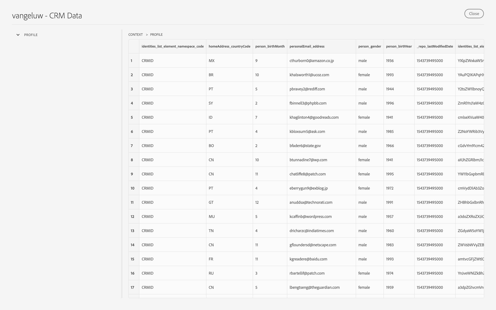

## Exercise 1.3: Data Ingestion from Offline Sources
In this exercise, the goal is to onboard external data like CRM Data in Platform.

### Learning Objectives

- Learn how to ingest XDM-formatted data files (*.parquet)
- Learn the web UI for data ingestion
- Understand the data governance features of Experience Platform

### Lab Resources

- Experience Platform UI: [https://platform.adobe.com/](https://platform.adobe.com/)
- Sample data .parquet file in Profile XDM format: [CRMData.parquet](https://git.corp.adobe.com/vangeluw/platformenablement/blob/master/module1/data_ingestion/downloads/CRMData.parquet)

### Lab Tasks

- Ingest and explore a .parquet file in the Experience Platform UI
- Understand data governance options in Experience Platform UI

### Story: Using the Data Ingestion UI

To start the base of the loyalty program, most companies are likely to have existing customer data. Here, we will perform a batch ingestion of an existing data file that contains customer profiles, pre-formatted in Profile XDM format. From the perspective of an Analyst/Architect, this will allow us to start adding customer data to Experience Platform through the web UI interface, as well as preview the ingested datasets to confirm using a snapshot of the data that the file and data has been correctly imported. Some data files may not be properly formatted in to Profile XDM format - in which case, a data ingestion may come up as `failed`. In addition, some fields in our Profile schema may be sensitive information - for example, a customer's address and phone number. These will need to be export-controlled using data governance.

For batch ingestion of data, it is important that the data is properly formatted into XDM prior to bringing it into our customer loyalty database on Experience Platform. Conversion of non-formatted data into Profile XDM will not be covered here, but will be assumed to have been performed prior by a Data Engineer. The initial release of Adobe Experience Platform will include a data-mapping tool for CSV-based data, which we will demonstrate to you after this chapter.

### Exercise 1.3.1 - Create your CRM Dataset in the Platform UI

Open the [Platform UI](https://platform.adobe.com) and go to "Data". 

Let's create a new dataset. Click the "Create Dataset" button, and select the "Create Dataset" option under "Schema" after that.

We're going to create a new dataset based on a schema, the Profile-schema, so we need to select the option to create the dataset based on a schema.

We'll upload CRM Data. CRM Data is always linked to a customer's profile, and as such, we need to select the Profile-schema here.

Click "Next" to continue.

Next, we need to define a name for our dataset. Let's use the same naming convention as before:

  * Profile Dataset name:
    * **ldap** - CRM Data

Click "Save" to save your dataset configuration.

### Exercise 1.3.2 - Enabling your datasets for Unified Profile

Next, we need to make sure that we enable this dataset for Unified Profile. This is not done automatically and as such needs to happen manually.
Any datasets tagged for Unified Profile will ingest data for Unified Profile consumption and will enable profile-stitching across datasets and also give a full 360-degree view of a specific profile.

In the Platform UI, go to the "Unified Profile" tab. 

Click "Manage" to manage which datasets are included in Unified Profile.

Enter your ldap in the search window to easily locate your CRM Dataset.

Click the + icon next to your CRM Dataset to add it to the list of datasets that are part of the Unified Profile.

Click "Enable" to save your changes.

Click "Confirm" to confirm your changes.

### Exercise 1.3.3 - Ingesting data into your Profile dataset

Download the sample data .parquet file which you can find [here](https://git.corp.adobe.com/vangeluw/platformenablement/blob/master/module1/data_ingestion/downloads/CRMData.parquet) to your local desktop.

In the Platform UI, go back to the "Data" tab. Enter your **ldap** in the search-window to easily locate your datasets.

Click on your newly created "**ldap** - CRM Data" dataset to open it.

On the dataset screen, have a look at the "Add Data"-option.

Click "Browse Data" and navigate on your computer to your desktop and select the file "CRMData.parquet".

The file will start uploading immediately.

After uploading the file, Platform will start the processing also immediately.

After a couple of minutes, the file will be successfully processed.

Click the "Preview" button to get a quick top-level view of a small sample of the dataset to ensure that the loaded data is correct.

Once data is loaded, we can define the correct data governance approach for our dataset.
   
### Exercise 1.3.4 - Adding data governance to your dataset 

Now that our customer data is ingested, we want to make sure that this dataset is properly governed for usage and export control. Click on the "Data Governance" tabe and observe that we can set three types of restrictions: Contractual, Identity, and Sensitive Data.

You can find more info on the different labels and how they will be enforced in the future through the policy framework on this link: [https://www.adobe.io/apis/experienceplatform/home/dule/duleservices.html](https://www.adobe.io/apis/experienceplatform/home/dule/duleservices.html) 
 

Let's restrict identity data for the entire dataset. Hover over your dataset name, and click the Pencil icon to edit the settings. 

Go to "Identity Data" and check the "I2" option - this will assume that all pieces of information in this dataset are _at least_ indirectly identifiable to the person.

Click "Save Changes" and observe that "I2" is now set for all data fields in the dataset. 

You can also set these flags for individual data fields - for example, the "personalEmail" field is likely an "I1" level for directly identifiable information.

Attention: due to a little bug (yep, we're still in alpha/beta), there's no visual confirmation when you've selected a data label. So if you don't see your changes reflect in the UI, it's expected behaviour.

With this, you've now successfully ingested and classified CRM Data in Adobe Experience Platform. You still need to make sure that La Boutique is fully GDPR compliant, so let's do that in the next exercise!

[Next Step: Using Adobe's Privacy/GDPR API](../gdpr/README.md)

[Go Back to Module 1](../README.md)

[Go Back to All Modules](/../../)

