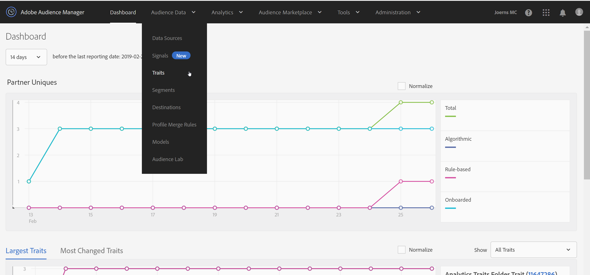
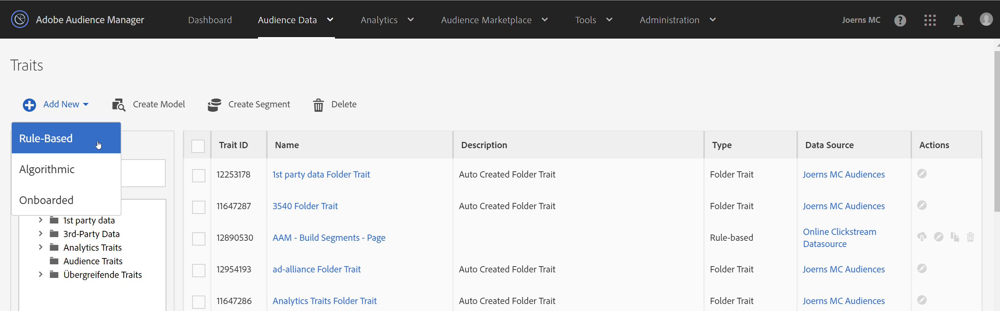
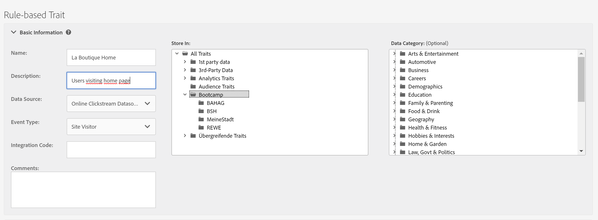
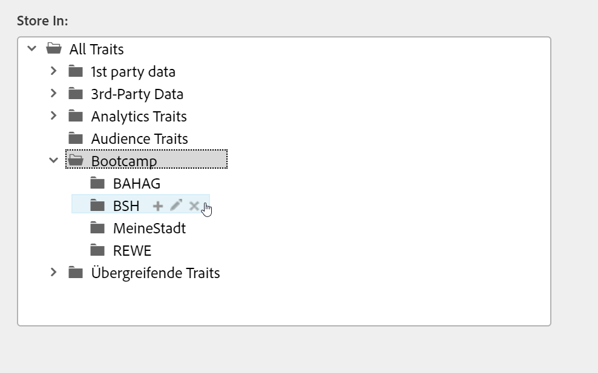
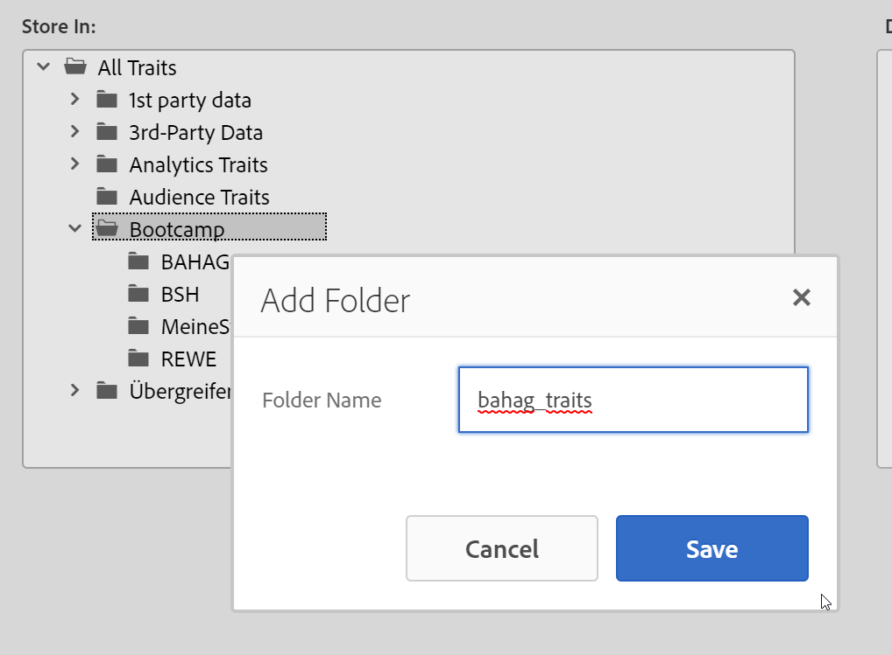
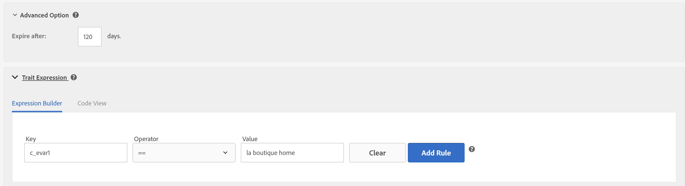

## Exercise 2.1 - Create a Trait and define your taxonomy

Go to [Experience Cloud UI](https://experiencecloud.adobe.com) and log in with the credentials provided to you. 

Click on "Sign In with an Adobe ID" and log in using email address and password.

You are now in the Experience Cloud Welcome screen. Go to the upper right corner and click on the icon with the 9 little bubbles.

From all the Experience Cloud solutions choose Audience Manager. You will be redirected to AAM.

Let's create a new trait. Click the "Audience Data" button in the upper bar and choose "Traits" from the dropdown menu.

Click at the "Add New" button and choose "Rule-Based" from the dropdown. 

For creating the new trait, provide the following details

| Name              | Description     | Data Source  | Event Type |
| ----------------- |:-------------:| :-----------------:| :--------:|
| La Boutique - Home         | User visiting Home page          | Online Clickstream Data Source         | Site Visitor     |

Each Trait must be stored in the folder taxonomy which can be found at the right side of the Trait details. Look for folder "Bootcamp" and create a subfolder within you companies folder by clicking at the "+" button. 

Name the subfolder: company_traits, replacing company with the name of your organization.

Choose your new folder to store your trait.

If you wish to learn more about taxonomy, [click](https://marketing.adobe.com/resources/help/en_US/aam/c_common_taxonomy_about.html)  here.

Go to "Trait Expression" and open the this area by clicking on the arrow.

Now you need to fill in the key:value pairs to define your trait.

| Key              | Operator     | Value |
| ----------------- |:-------------:| :-----------------:|
|c_evar1 (this is why you need to put a c_ in front of evar1: [Click here](https://marketing.adobe.com/resources/help/en_US/aam/r_tb_variable_prefixes.html)| ==         |la boutique home        |

Click on "Add Rule" and save the Trait by clicking "Save".

**Repeat this for evar2 & evar3 with the following components:**

| Key              | Operator     | Value |
| ----------------- |:-------------:| :-----------------:|
|c_evar2 | CONTAINS        |chrome       |

| Key              | Operator     | Value |
| ----------------- |:-------------:| :-----------------:|
|c_evar3 | CONTAINS        |cart|

### [Next Exercise 2.2](./ex2.md)
#### [Go back to Exercise 2 overview](./README.md)
#### [Go back to General Overview](../README.md)

