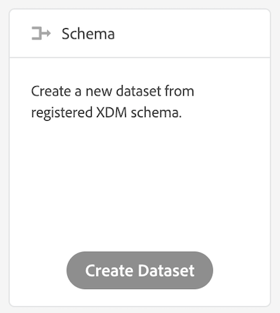

## Exercise 2.1 - Create a Trait and define your taxonomy

Go to [Experience Cloud UI](https://experiencecloud.adobe.com) and log in with the credentials provided to you. 

Click on "Sign In with an Adobe ID" and log in using email address and password.

You are now in the Experience Cloud Welcome screen. Go to the upper right corner and click on the icon with the 9 little bubbles.

From all the Experience Cloud solutions choose Audience Manager. You will be redirected to AAM.

Let's create a new trait. Click the "Audience Data" button in the upper bar and choose "Traits" from the dropdown menu.

Click at the "Add New" button and choose "Rule-Based" from the dropdown. 

For creating the new trait, provide the following details

Name: La Boutique - Home
Description: User visiting Home page
Data Source: Online Clickstream Data Source
Event Type: Site Visitor

Each Trait must be stored in the folder taxonomy which can be found at the right side of the Trait details. Look for folder "Bootcamp" and create a subfolder within you companies folder by clicking at the "+" button. 

Name the subfolder: company_traits, replacing company with the name of your organization.

Choose your new folder to store your trait.

If you wish to learn more about taxonomy, [click] (https://marketing.adobe.com/resources/help/en_US/aam/c_common_taxonomy_about.html)  here.

Go to "Trait Expression" and open the this area by clicking on the arrow.

Now you need to fill in the key:value pairs to define your trait.

Key: c_evar1 
Operator: == 
Value: la boutique home

We're going to create a new dataset based on a schema, the Profile-schema, so we need to select the option to create the dataset based on a schema.

We'll upload CRM Data. CRM Data is always linked to a customer's profile, and as such, we need to select the Profile-schema here.
