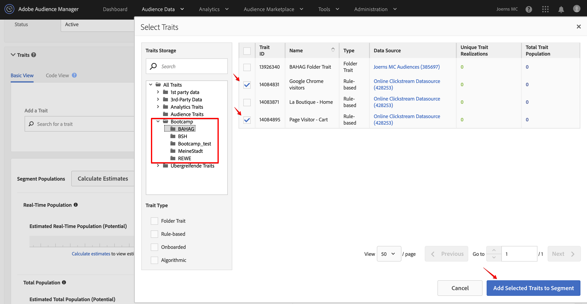

## Exercise 2.2 - Create a Segment

Go to [Experience Cloud UI](https://experiencecloud.adobe.com) and log in with the credentials provided to you. 

Click on "Sign In with an Adobe ID" and log in using email address and password.

You are now in the Experience Cloud Welcome screen. Go to the upper right corner and click on the icon with the 9 little bubbles.

From all the Experience Cloud solutions choose Audience Manager. You will be redirected to AAM.

Let's create a new segment. Click the "Audience Data" button in the upper bar and choose "Segments" from the dropdown menu.

Click at the "Add New" button.

Complete Basic Information by giving the segment a name, description, data source and folder location. 

| Name              | Description     | Data Source  |
| ----------------- |:-------------:| :-----------------:|
| La Boutique - Home         | User visiting Home page          | Online Clickstream Data Source         |

Don't worry about the other areas, keep the default settings for now. 
Each segment must be stored in the folder taxonomy which can be found at the right side of the segment details. Look for folder "Bootcamp" and create a subfolder within you companies folder by clicking the "+" button. 

Name the subfolder: company_segments, replacing company with the name of your organization.

Choose your new folder to store your segment.

Now we need to assign a trait (could also be multiple traits) to our new segment. 
Go to "Traits" and open this section by clicking on the arrow.

Search for the trait by name, or use the Advanced Search modul by clicking "Browse All Traits".

In this pop-up window, first look for your traits in the taxonomy folders in the left navigation panel. 
Click into your folder and the associated traits will be listed in the main window. 

Select your trait "La Boutique - Home" and click "Add Selected Traits to Segment".

Your trait has now been assigned to the segment. For now, we will only assign one trait per segment. Later we will also add multiple traits to combine them via boolean operators. Go ahead and save the segment by clicking the "Save" button.

After creating the "La Boutique - Home" segment, go ahead and repeat the same steps to create a segment for each of the other two traits as well. 

Segment: Google Chrome visitors

| Name              | Description     | Data Source  |
| ----------------- |:-------------:| :-----------------:|
| Google Chrome visitors         | User visiting from chrome browser          | Online Clickstream Data Source         |

Segment: Page Visitor - Cart

| Name              | Description     | Data Source  |
| ----------------- |:-------------:| :-----------------:|
| Page Visitor - Cart         | User visiting Cart page          | Online Clickstream Data Source         |

You have now created the 3 basics segments. Next, let's create a segment combining multiple traits by setting boolean operators.

Click on "Add New" in Segment Builder and provide the following details to create the segment. Remember to store your segment in your taxonomy.

| Name              | Description     | Data Source  |
| ----------------- |:-------------:| :-----------------:|
| High Interest users         | High Interest users         | Online Clickstream Data Source         |

In this audience we only want users who have shown high interest by reaching the cart page. Let's assume this audience is going to be used for onsite personalisation and some of the testing content cannot be displayed properly in a Chrome browser which would affect conversion rate negatively. Hence, we need to exclude all Google Chrome users from this audience. 

Go to the Traits section and click at the "Browse All Traits" button.
In the folder taxonomy browse your folder to find your traits. Select the following traits:

Page Visitor - Cart

Google Chrome visitors

Go and click "Add Selected Traits to Segment".

You can move traits up or down by mouse-overing the trait and clicking the icon looking like 6 bubbles. Click to move the trait up or down. Since we want to exclude the Chrome users, make sure trait "Google Chrome visitors" is down:

Mouse-over between the two traits, just where the 3 dots are located. A dropdown menu will show up. From the boolean operators, select "AND NOT" to exclude all Chrome users from our audience.

Save the segment.

Congratulations. You have now created 4 segments. Next, let's build & map destinations to activate our segments.

### [Next Exercise 3: Build & map destinations](../destinations)
#### [Go back to Exercise 2 overview](./README.md)
#### [Go back to General Overview](../README.md)

