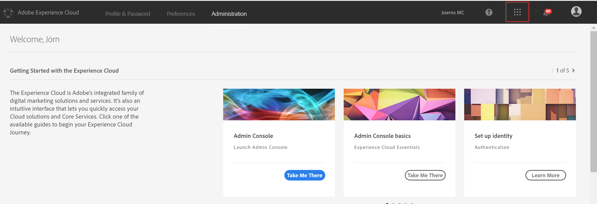

## Exercise 2.1 - Create a Segment

Go to [Experience Cloud UI](https://experiencecloud.adobe.com) and log in with the credentials provided to you. 

Click on "Sign In with an Adobe ID" and log in using email address and password.

You are now in the Experience Cloud Welcome screen. Go to the upper right corner and click on the icon with the 9 little bubbles.

From all the Experience Cloud solutions choose Audience Manager. You will be redirected to AAM.

Let's create a new segment. Click the "Audience Data" button in the upper bar and choose "Segments" from the dropdown menu.

Click at the "Add New" button.

For creating the new segment, provide the following details

| Name              | Description     | Data Source  |
| ----------------- |:-------------:| :-----------------:|
| La Boutique - Home         | User visiting Home page          | Online Clickstream Data Source         |

Don't worry about the other areas, keep the default settings for now. 
Each segment must be stored in the folder taxonomy which can be found at the right side of the segment details. Look for folder "Bootcamp" and create a subfolder within you companies folder by clicking at the "+" button. 

Name the subfolder: company_segments, replacing company with the name of your organization.

Choose your new folder to store your segment.

If you wish to learn more about taxonomy, [click](https://marketing.adobe.com/resources/help/en_US/aam/c_common_taxonomy_about.html)  here.

Now we need to assign a trait (could also be multiple traits) to our new segment. 
Go to "Traits" and open the this section by clicking on the arrow.

Click on "Browse All Traits" to choose traits for building the segment.

**Repeat this for evar2 & evar3 with the following components:**

| Key              | Operator     | Value |
| ----------------- |:-------------:| :-----------------:|
|c_evar2 | CONTAINS        |chrome       |

| Key              | Operator     | Value |
| ----------------- |:-------------:| :-----------------:|
|c_evar3 | CONTAINS        |cart|

### [Next Exercise 2.2 - Create a Segment](./ex2.md)
#### [Go back to Exercise 2 overview](./README.md)
#### [Go back to General Overview](../README.md)

