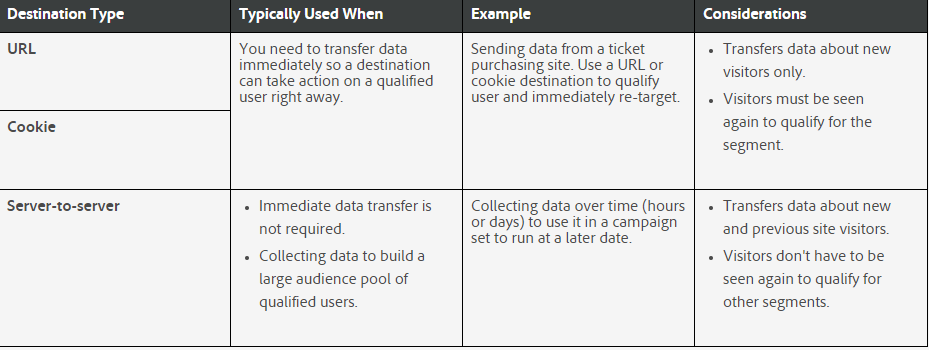

## Exercise 3: Build & map destinations
In this exercise, the goal is to create a Cookie & URL  Destination and map Segments to both destinations.

### Learning Objectives

- Learn more about the differnent destination types
- Understand how to build a Cookie destination
- Understand how to build a URL destination
- Map your segments to destinations

### Lab Resources

- Experience Cloud UI: [https://experiencecloud.adobe.com/](https://experiencecloud.adobe.com/)

### Lab Tasks

- Creating both destinations
- Activating a segment to a destination

### Story:

We have already learned how we build some traits and segments. Now it is time to activate them. We will build destinations step by step and activate your segments against your new destinations.

### What are destinations?

In Audience Manager, a destination is any third-party system (ad server, DSP, ad network, etc.) that you want to share data with. We want to use the Destination Builder, used to create and manage cookie, URL, or server-to-server destinations.

### Destination Types and Typical Uses

The examples in the following table can help you understand when to use a particular destination and the differences between each type.

Click here to learn more about [URL Destinations](https://marketing.adobe.com/resources/help/en_US/aam/create-url-destination.html) and [Cookie Destinations](https://marketing.adobe.com/resources/help/en_US/aam/create-cookie-destination.html).

### [Excercise 3.1 - Create a Cookie destination](./ex1.md)

### [Excercise 3.2 - Create a URL destination](./ex2.md)

### [Excercise 3.3 - Map a segment to a destination](./ex3.md)

[Go Back to Excercise 2 - Build Traits & Segments](./README.md)

[Go Back to All Modules](/../../)

