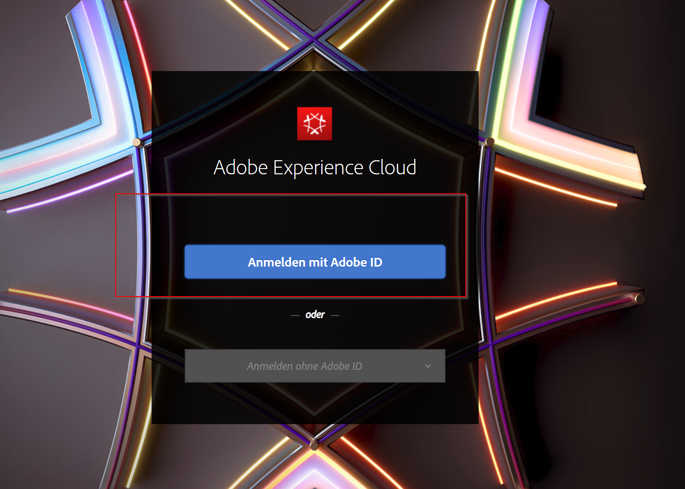
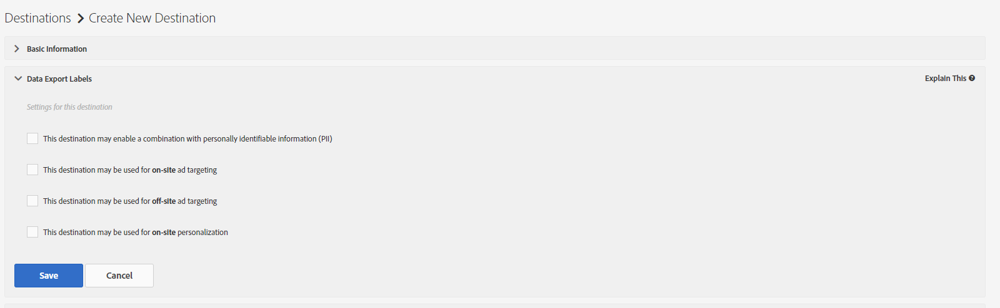
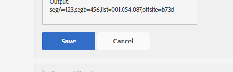

## Exercise 3.1 - Create a Cookie destination

Go to [Experience Cloud UI](https://experiencecloud.adobe.com) and log in with the credentials provided to you. 

Click on "Sign In with an Adobe ID" and log in using email address and password.

You are now in the Experience Cloud Welcome screen. Go to the upper right corner and click on the icon with the 9 little bubbles.

From all the Experience Cloud solutions choose Audience Manager. You will be redirected to AAM.

Let's create a Destination. Click the "Audience Data" button in the upper bar and choose "Destinations" from the dropdown menu.

Click at the "Create New Destination" (+) button from the selection. 

First we want to create a custom Cookie Destination that could be used by nearly all Partners that you might want to work with. 

| Name              | Description | Category  | Type |	Auto-fill	|
| ----------------- | ----------- | --------- | ---- |  --------    |
| aam_bootcamp_YOURLASTNAME | This is your Cookie | Custom | Cookie |	|

Hit "**next**".

We don't need to check one of the Export Labels so skip this step by clicking on "**Configuration**"

Alright now we need to configure our Cookie:

* Cookie Name: aam_bootcamp_YOURLASTNAME 
* Cookie Domain: aam-bootcamp.de
* Max Size: 2048
* Expire after: 30
* Publish data to: All of our domains
* Data Format: Single Key
* Key: segment
* Key-Value Pair Delimiter: =
* Serialize: 

Just hit "Save"

Wohooo! We have created our first Cookie destination. 

### [Next Exercise 3.2 - Build a URL a destination](./ex2.md)

#### [Go back to Exercise 3 overview](./README.md)
#### [Go back to General Overview](../README.md)

