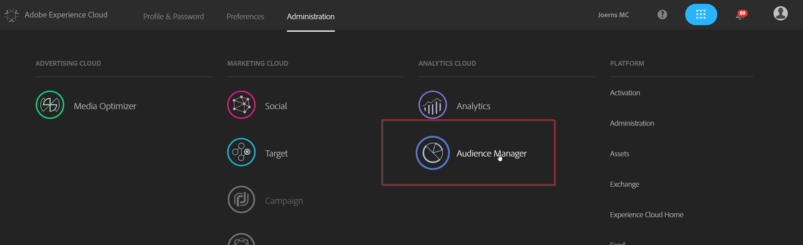
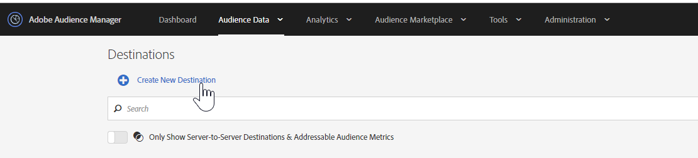

## Exercise 3.2 - Create a URL destination

Go to [Experience Cloud UI](https://experiencecloud.adobe.com) and log in with the credentials provided to you. 

Click on "Sign In with an Adobe ID" and log in using email address and password.

You are now in the Experience Cloud Welcome screen. Go to the upper right corner and click on the icon with the 9 little bubbles.

From all the Experience Cloud solutions choose Audience Manager. You will be redirected to AAM.

Let's create a Destination. Click the "Audience Data" button in the upper bar and choose "Destinations" from the dropdown menu.

Click at the "Create New Destination" (+) button from the selection. 

Now we want to build a URL destination. Typical usecases could be Google Remarketing Lists (RLSAs) or Facebook Custom Audiences. For this we select the following settings:

| Name              | Description | Category  | Type |	Auto-fill	|
| ----------------- | ----------- | --------- | ---- |  --------    |
| aam_bootcamp_YOURLASTNAME_url | This is my URL destination | Custom | URL |	|

Hit "**next**".

We don't need to check one of the Export Labels so skip this step by clicking on "**Configuration**"

Just click on "**save**"

That's it. Easy isn't it?

### [Next Exercise 3.3 - Map segments](./ex3.md)

#### [Go back to Exercise 3 overview](./README.md)
#### [Go back to General Overview](../README.md)

