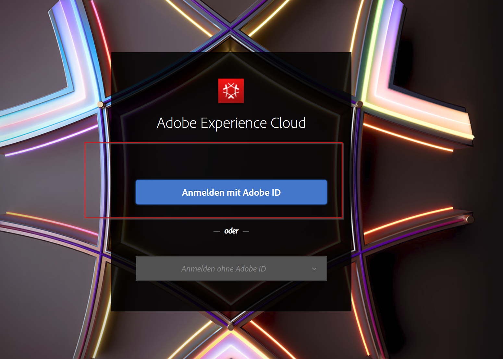
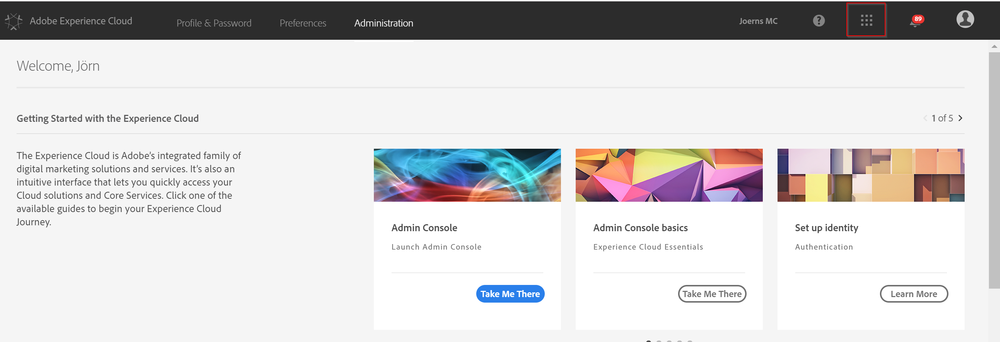
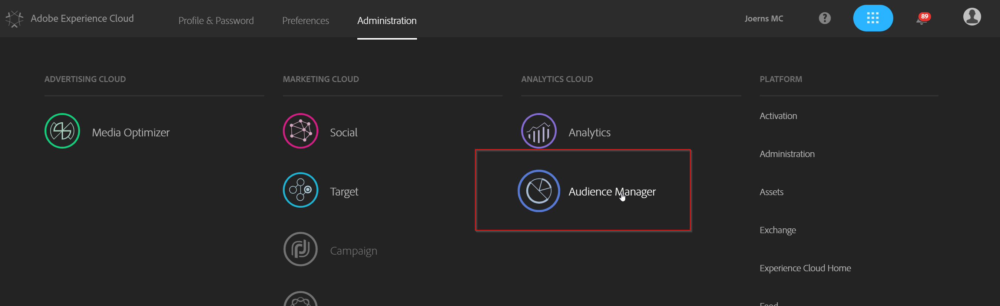

## Exercise 3.3 - Map a segment to a destination

### Map a segment to a Cookie destination

Go to [Experience Cloud UI](https://experiencecloud.adobe.com) and log in with the credentials provided to you. 

Click on "Sign In with an Adobe ID" and log in using email address and password.

You are now in the Experience Cloud Welcome screen. Go to the upper right corner and click on the icon with the 9 little bubbles.

From all the Experience Cloud solutions choose Audience Manager. You will be redirected to AAM.

Let's create a Destination. Click the "Audience Data" button in the upper bar and choose "Segments" from the dropdown menu.

First we start with your Cookie Destination. Just select the segments that you have just created before and select them.

Now click on "**Add to Destination**"

Perfect, now choose your cookie destination first.

Next step is to fill out the "**Destination Value**" that will be visible within your Cookie. Just type in the name of the segments without spaces or "umlauts (ä,ö,ü etc.)". If we want to use them we would need to enable Serialize within the Cookie setup. The Start date should be today.  

Just click on "**save**"

Great work! You have mapped your first segments to a Cookie destination. 

### Map a segment to a URL destination

#### [Go back to Exercise 3 overview](./README.md)
#### [Go back to General Overview](../README.md)

