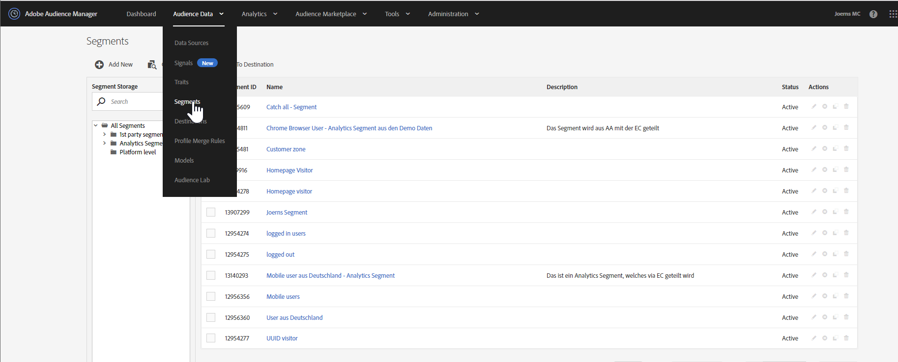
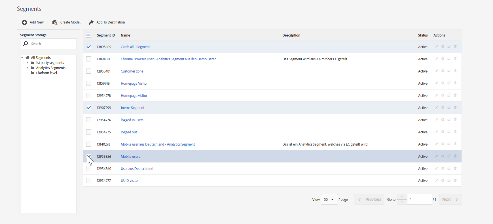
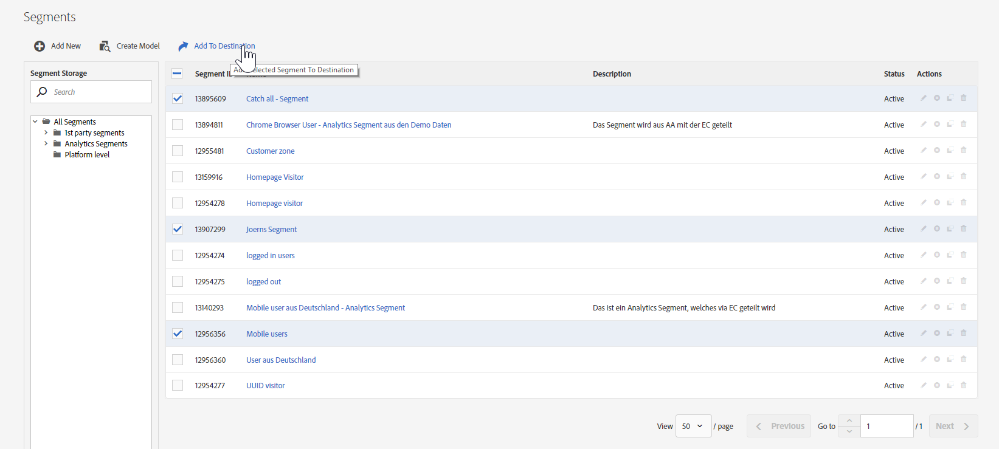
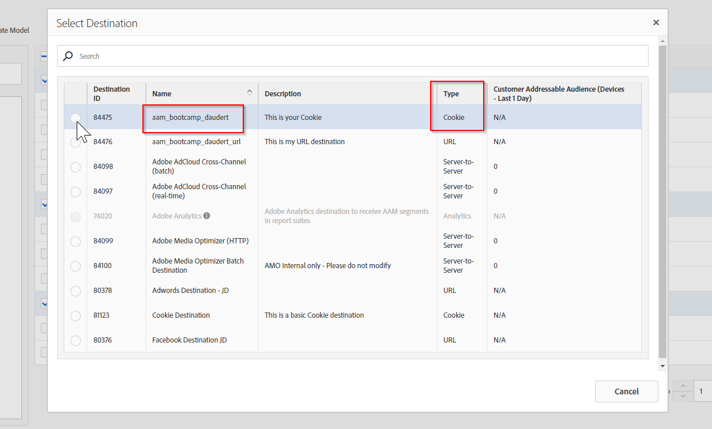
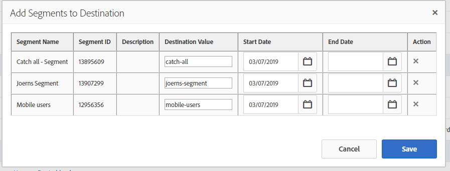
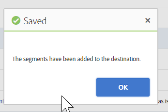
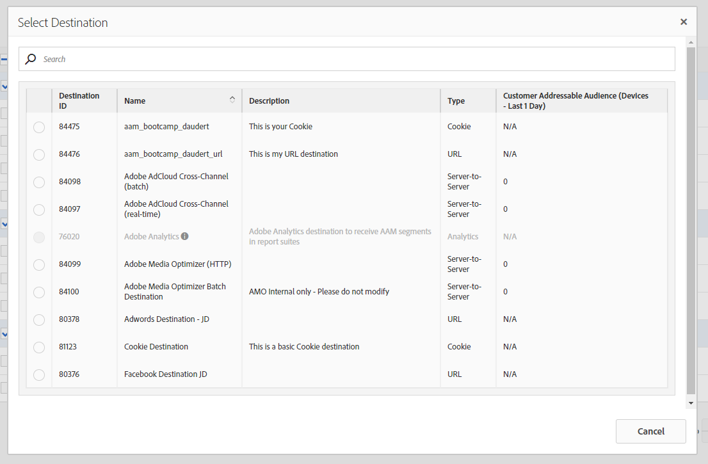
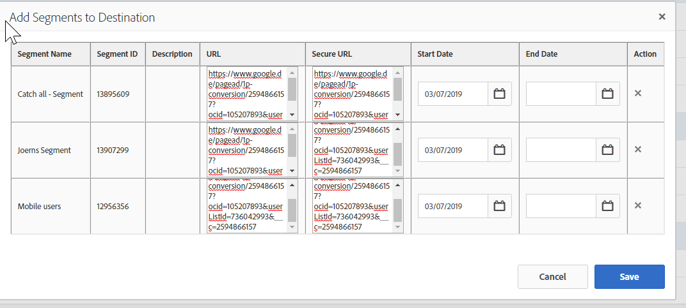

## Exercise 3.3 - Map a segments to a destination

### Cookie destination

Click the "Audience Data" button in the upper navigation bar and choose "Segments".

First we start with your Cookie Destination. Just select the segments that you have just created before and select them.

Now click on "**Add to Destination**"

Perfect, now choose your cookie destination first.

Next step is to fill out the "**Destination Value**" that will be visible within your Cookie. Just type in the name of the segments without spaces or "umlauts (ä,ö,ü etc.)". If we want to use them we would need to enable Serialize within the Cookie setup. The start date should be today.

Just click on "**save**"

Great work! You have mapped your first segments to a Cookie destination. 

### URL destination

Click the "Audience Data" button in the upper navigation bar and choose "Segments".

Just select the segments that you have just created before and select them.

Now click on "**Add to Destination**"

Now select your URL destination

Now we need to fill in the destination URL. This will be  typically an URL hat contains a pixel. As an example we will use my RLSA List:

URL: http://www.google.de/pagead/1p-conversion/2594866157?ocid=105207893&userListId=736042993&__c=2594866157

Secure URL: https://www.google.de/pagead/1p-conversion/2594866157?ocid=105207893&userListId=736042993&__c=2594866157

Just click on "**save**" & we have mapped our segments. 

#### [Go back to Exercise 3 overview](./README.md)
#### [Go back to General Overview](../README.md)