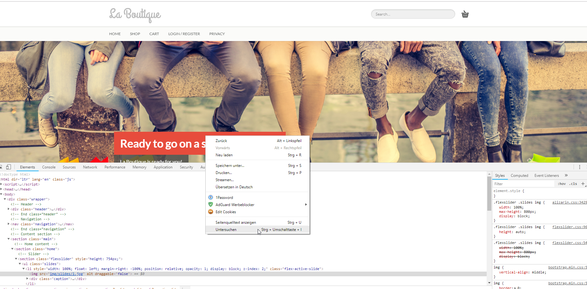
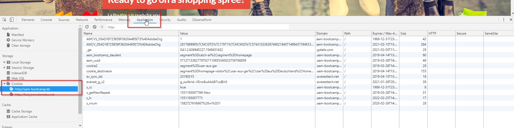
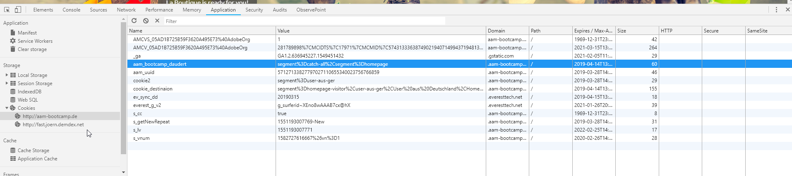

## Testing your Cookie destination

**Info: It could take up to 2 hours until your brand new Cookie destination appears on 

Now we want to check whether our cookie works or not. To do this we return to our site aam-bootcamp.de & open the developer tools with right click & inspect element. 

We click on **Application** and navigate on the left side under **Cookies** to **http://aam-bootcamp.de** 

Now we see all cookies that are set on our bootcamp domain. Your cookie should be visible with your name.

Example: **aam_bootcamp_daudert**

### We did it! Well done. 

[Go Back to Excercise 3](../destinations)

[Go Back to All Modules](/../../)
