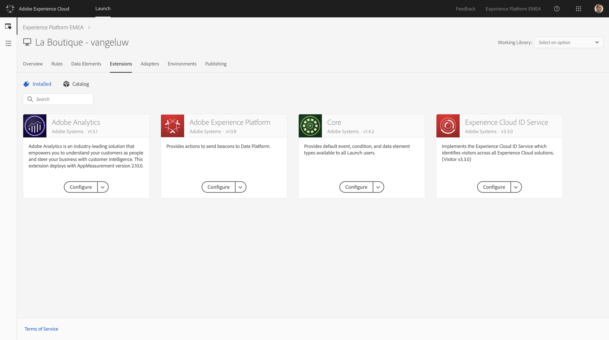
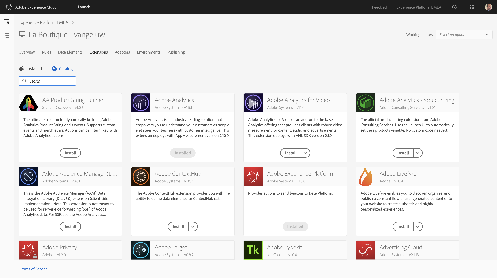
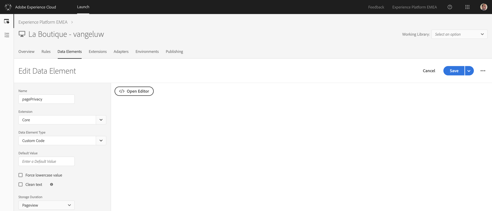
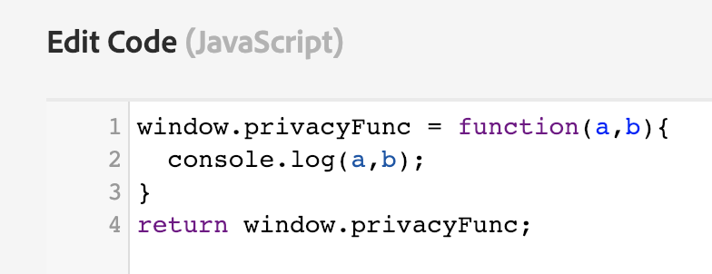
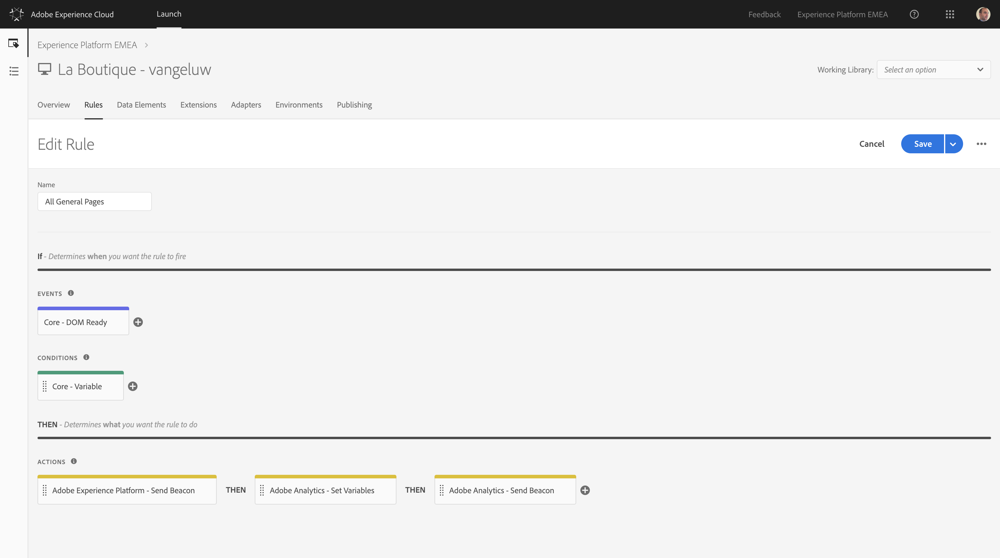
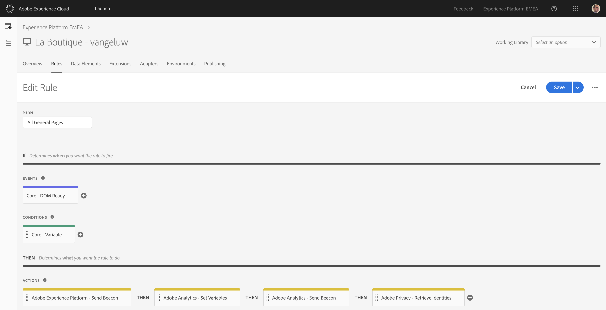
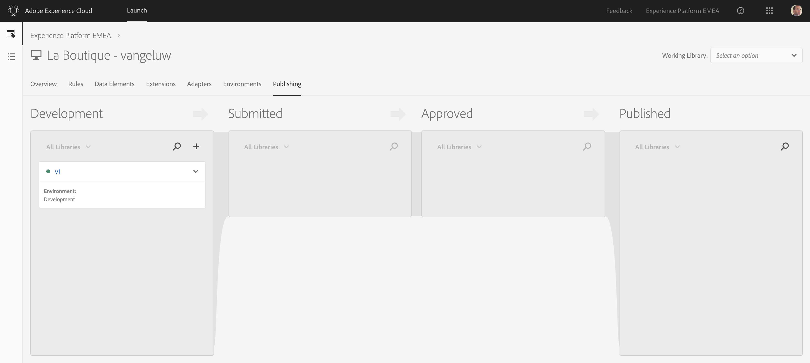
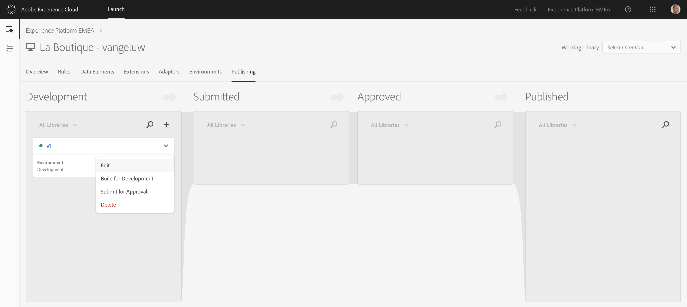
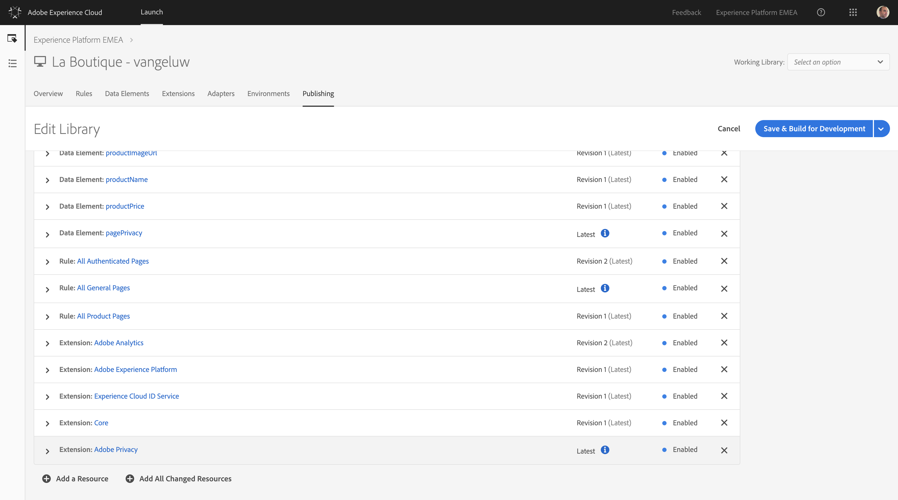

## Exercise 1.4.1 - Implement the Adobe Privacy Extension through Launch

Go to [https://launch-demo.adobe.com/](https://launch-demo.adobe.com/) and login with your personal login details.

Make sure that you are in the correct company 'Experience Platform EMEA' by checking the top right part of your screen.


Search for your Launch property by specifying your ldap in the Search-window. Select your Launch property to update your Launch configuration with the Adobe Privacy extension.


To add the Adobe Privacy extension, go to Extensions.



Go to Catalog.



In the search box, enter "privacy" to search for the Adobe Privacy extension.


Click "Install" to install the Adobe Privacy Extension.


On the next screen, you need to configure the Privacy Extension.


Check the boxes for:

  * AA
  * AAM
  * Visitor
  * AdCloud

Then click the "Update"-button.


After clicking the "Update"-button, you'll see a "Properties"-window appear.

Enter the following setting in the properties.

| Property Key  | Property Value   |
|:-------------:| :---------------:|
| imsOrgID      |907075E95BF479EC0A495C73@AdobeOrg|
| reportSuite   |epmeademoenvironment|
| trackingServer|experienceplatformemea.sc.omtrdc.net|

The Property Key for "trackingServer" needs to be added manually, by selecting trackingServer out of the dropdown-list and clicking the "Add"-button.


Click "Save" to save your changes.

Next, we need to create a Data Element to capture the Adobe Privacy extension's information.

Go to Data Elements and click "Add Data Element".


Configure the Data Element as follows:

| Name          | Extension     | Data Element Type  | Storage Duration |
| ------------- |:-------------:| :-----------------:| :--------------: |
| pagePrivacy   | Core          | Custom Code        | Pageview         |




Open the Editor by clicking on "Open Editor".

This is the custom code to enter here:

```javascript
window.privacyFunc = function(a,b){
  console.log(a,b);
}
return window.privacyFunc;
```



Save your code fragment and then click "Save" again to save your data element configuration.

Next, we need to update our Launch rule for "All General Pages".


Go to Rules and open your "All General Pages"-rule.



Go to the Actions and click the + icon to add an Action.


Configure the new action as indicated below.

| Extension       | Action Type         | Name                                |
|:---------------:| :------------------:| :---------------------------------: |
| Adobe Privacy   | Retrieve Identities | Adobe Privacy - Retrieve Identities |


In the Action's details, we need to select a Data Element to capture the Adobe Privacy information. Select the Data Element that you built in the previous step, called %pagePrivacy%.


Click "Keep Changes" to save your Action.



Don't forget to click "Save" to save your changes

Lastly, we need to publish our updates to the Launch property's configuration.

To do this, go to Publishing.



Edit your Development environment, v1. Open the dropdown menu and select "Edit".



Scroll down until you see the "Add All Changed Resources"-button.


Click the "Add All Changed Resources"-button. As a result, your recent changes linked to the Adobe Privacy extension will now be part of your Development-library.



Click "Save & Build for Development" to pubish your changes.


Wait 30sec - 2min to see your new library being successfully built.


Once there's a green dot next to your "v1" library, your changes are deployed.


In the next exercise, we'll see the impact of this configuration on the La Boutique website.

[Next Step: Exercise 1.4.2 - Retrieve your specific Adobe ID's](./ex2.md)


