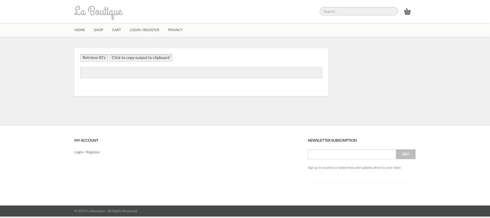
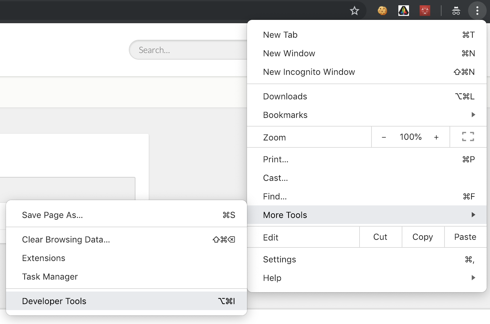
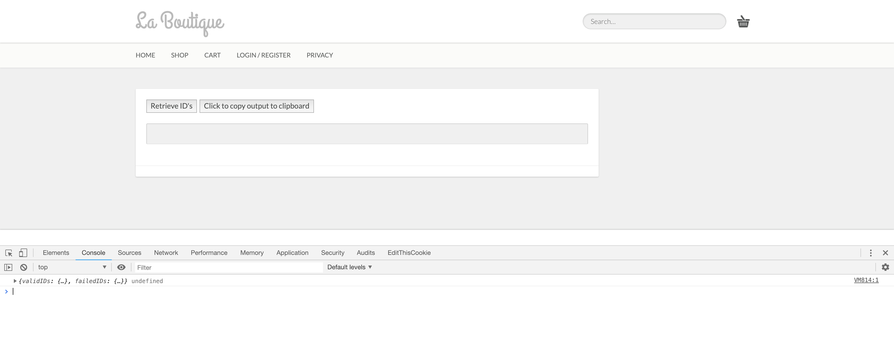
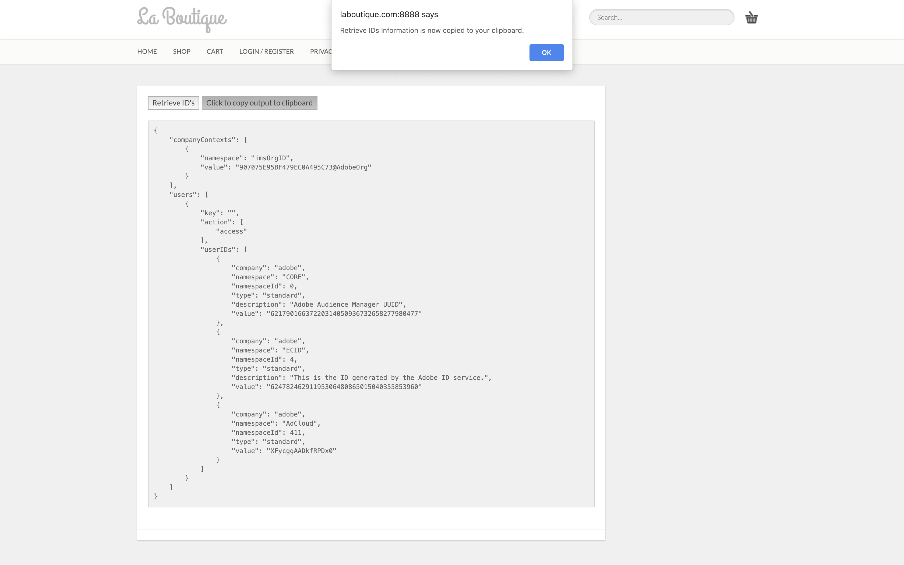
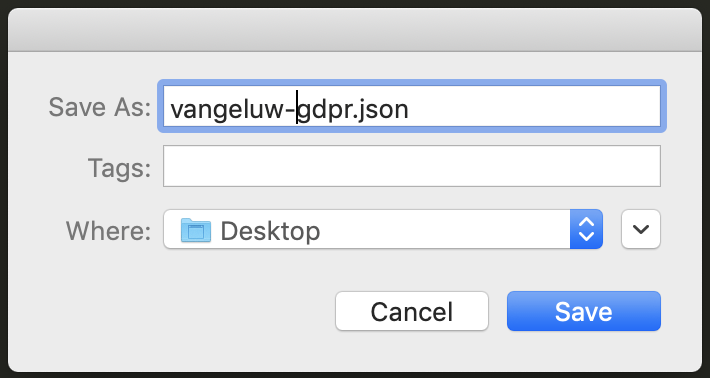

## Exercise 1.4.2 - Retrieve your specific Adobe ID's

Go to your La Boutique website and open the Privacy page.



Open the Chrome Developer Tools from the Settings menu:



Go to Console-view and refresh the page.


After refresh, you'll see a line of text containing validids/failedids:



You can open the different nodes of the object to find information like  the ECID in this browser on this device.


This data is available as a data element and is the consequence of your configuration in Launch. When a customer has raised an access, control or delete request this data element is populated and made available to the Data Protection Officer of the brand. It is then the task of this DPO to further treat this request and eventually, provide the requested information back to the customer.

For the purpose of our exercise, a visualization of this data in JSON-format is available on the La Boutique Privacy-page.
Click the Retrieve ID's-button to display this information.


Next, click on the button "Click to copy output to clipboard".



The ouput containing the Retrieve IDs information is now copied to the clipboard of your computer. Open a new, empty text file in your preferred text editor and paste the copied text in there.


You will find this text in the document on line 10:

```javascript
"key": "",
```
In a real-world situation, the "key" value would be a customer's specific identifier like f.i. a hashed email-address or CRM identifier.

For our demo-setup, change this as follows:

```javascript
"key": "yourldap",
```

So the final version of line 10 becomes something like this:

```javascript
"key": "vangeluw",
```


**ATTENTION** 
There has been an update to the GDPR API requirements on Thursday Feb 14, 2019. In the GDPR Request, a new parameter needs to be included that specifies the solutions for which the GDPR API needs to return values.

This change is documented [here](https://www.adobe.io/apis/experienceplatform/gdpr/docs/alldocs.html#!api-specification/markdown/narrative/gdpr/use-cases/gdpr-api-overview.md#product-values).

The extra code to manually include in the json-request file is this one (don't forget the comma):

```
,
	"include":[
		"Analytics",
		"AudienceManager",
		"AdCloud",
		"AdobeCloudPlatform",
		"CRS"
	]
```

This code block needs to be included after the last square bracket ("]") at the bottom of the file. After manually adding the above code block to the output from the Retrieve ID's-function, your request should look like this:

```
{
    "companyContexts": [
        {
            "namespace": "imsOrgID",
            "value": "907075E95BF479EC0A495C73@AdobeOrg"
        }
    ],
    "users": [
        {
            "key": "vangeluw",
            "action": [
                "access"
            ],
            "userIDs": [
                {
                    "company": "adobe",
                    "namespace": "CORE",
                    "namespaceId": 0,
                    "type": "standard",
                    "description": "Adobe Audience Manager UUID",
                    "value": "05226746778088423994463810995814848888"
                },
                {
                    "company": "adobe",
                    "namespace": "ECID",
                    "namespaceId": 4,
                    "type": "standard",
                    "description": "This is the ID generated by the Adobe ID service.",
                    "value": "05579517237520120744399017964287534797"
                },
                {
                    "company": "adobe",
                    "type": "integrationCode",
                    "description": "This is the unique user id in the specified namespace (data source).",
                    "namespace": "CustomerID",
                    "value": "woutervangeluwe6@gmail.com"
                },
                {
                    "company": "adobe",
                    "namespace": "AdCloud",
                    "namespaceId": 411,
                    "type": "standard",
                    "value": "XDcr1QAADnDvJjx0"
                }
            ]
        }
    ],
	    "include":[
	        "Analytics",
	        "AudienceManager",
	        "AdCloud",
	        "AdobeCloudPlatform",
	        "CRS"
	    ]
}
```

Save the file on your desktop and name it "**yourldap**-gdpr.json".



After saving the file, you're now ready to launch your first GDPR request through the GDPR UI.

[Next Step: Exercise 1.4.3 - Launch a GDPR Access Request through the GDPR UI](./ex3.md)


