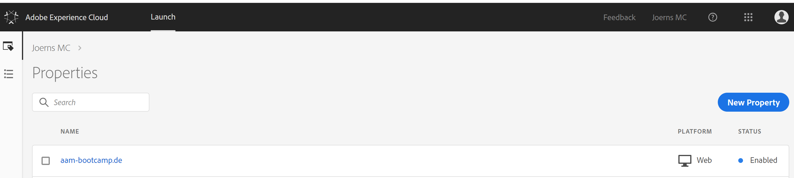
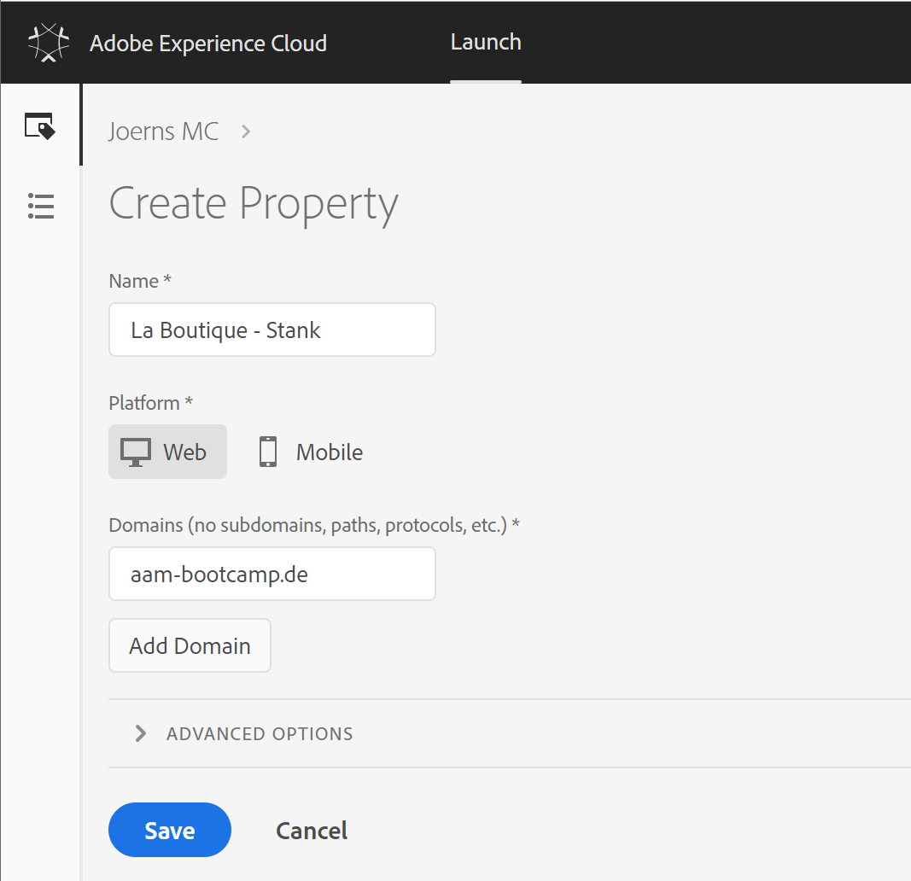

## Exercise 1.2.1 - Create a Launch Property

Go to [https://launch.adobe.com/](https://launch.adobe.com/) and login with your personal login details.

Create a New Launch Property by clicking on the 'New Property'-button.

We've defined a naming convention which needs to be respected:

Name of your Launch Property: "La Boutique - **Lastname**". Please replace **Lastname** with your personal Lastname. Example: "La Boutique - Mueller"

Domain of your Launch Property: "aam-bootcamp.de".

Click Save to finish configuring your property.

[Next Step: Exercise 1.2.2 - Configure Launch Extensions](./ex2.md)

