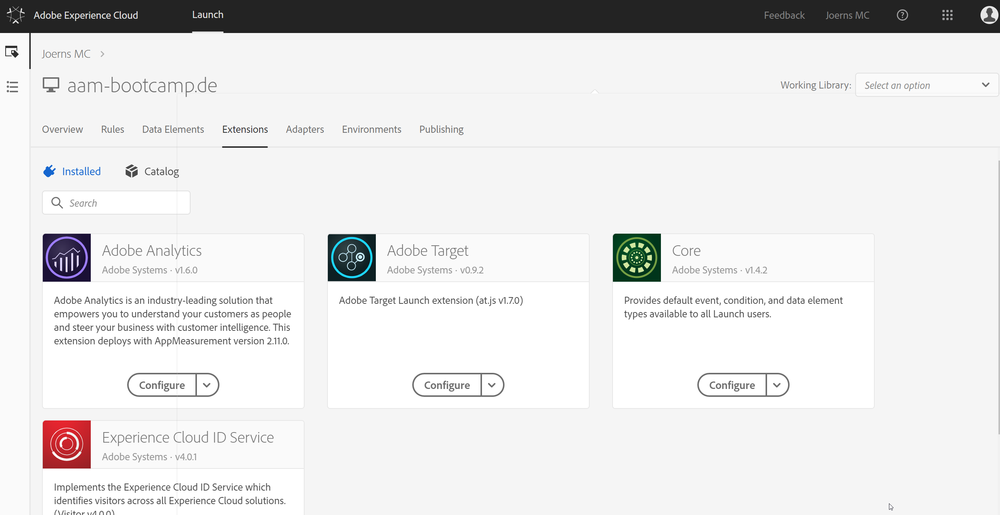

## Exercise 1.2 - Configure Launch Extensions

Go to [https://launch.adobe.com/](https://launch.adobe.com/) and login with your personal login details.

Open your Launch property.
From the property landing page, go to Extensions.

In Extensions, go to Catalog.

The Extensions Catalog holds all of the available Launch Extensions.

Search for "Experience Cloud ID Service" and click "Install".

Accept the default settings and click "Save".

Go back to the Extensions Catalog, search for Adobe Analytics and click "Install".

In the Adobe Analytics extension window, first of all we need to select the Adobe Analytics Report Suite.
The report suite to use is called **cgeo1xxlonaam-bootcamp**.

Next, we have to define the General Settings, which includes the Tracking Server we'll be using.
As a Tracking Server, please use **joernsmc.d3.sc.omtrdc.net**.

Scroll down until you find the "Adobe Audience Manager" - menu.
Check the checkbox top activate the option "Automatically share Analytics Data with Audience Manager" and in the Audience Manager Subdomain menu, type **joern**.

Save your changes.

Search for "Target" and click "Install". Accept the default settings and click "Save".

You now have 4 extensions installed in your Launch property:

Your Launch property now has all required extensions!

[Next Step: Exercise 1.2.3 - Configure Launch Data Elements](./ex3.md)

