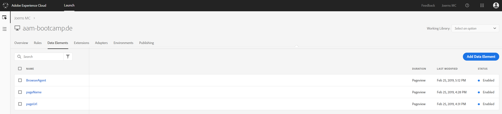
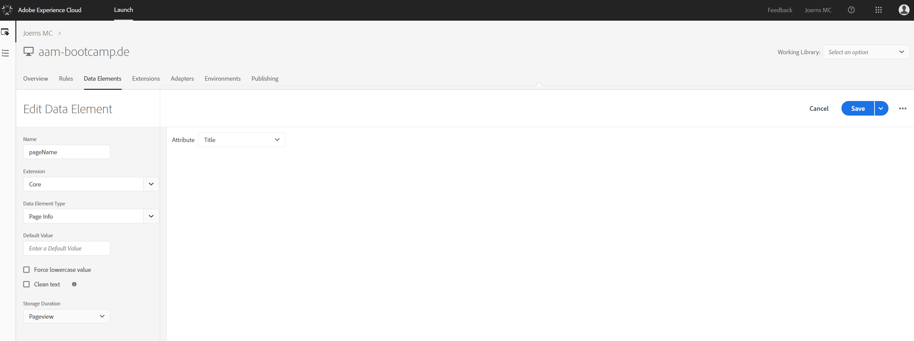
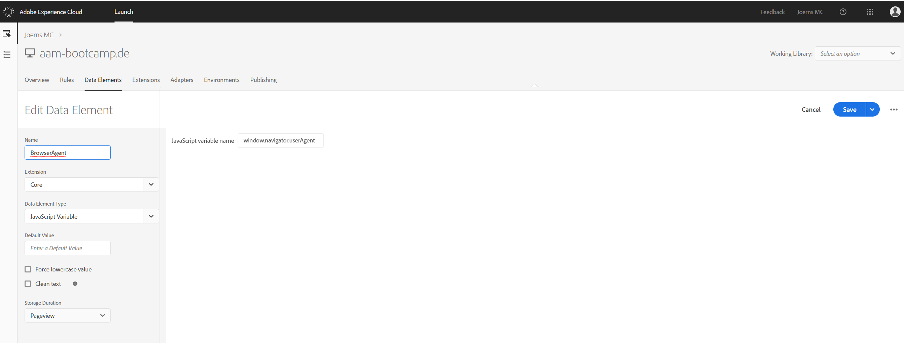

## Exercise 1.3 - Configure Launch Data Elements

Go to [https://launch.adobe.com/](https://launch.adobe.com/) and login with your personal login details.

After creating and configuring the extensions, we're now ready to configure Data Elements. 

In the Launch UI, go to Data Elements and click on "Create New Data Element".

The first data element we need is called **pageName**. On every new pageload, we need to capture the page name and send it to AA, AAM.

| Name              | Extension     | Data Element Type  | Attribute | Storage Duration |
| ----------------- |:-------------:| :-----------------:| :--------:| :--------------: |
| pageName          | Core          | Page Info          | Title     | Pageview         |

Save your new data element.

Next: **pageUrl**. On every new pageload, we need to capture URL of the page.

| Name               | Extension     | Data Element Type     | Attribute        | Storage Duration |
| ------------------ |:-------------:| :--------------------:| :------------------------------:| :--------------: |
| pageUrl           | Core          | Page Info   | Url | Pageview         |

Save your new data element.

Next: **browserAgent**. On every new pageload, we need to capture the UserAgent.

| Name               | Extension     | Data Element Type     | JavaScript variable name        | Storage Duration |
| ------------------ |:-------------:| :--------------------:| :------------------------------:| :--------------: |
| browserAgent       | Core          | JavaScript Variable   | window.navigator.userAgent| Pageview         |

Save your new data element.

You've finished configuring all required data elements!

[Next Step: Exercise 1.2.4 - Configure Platform Datasets](./ex4.md)
