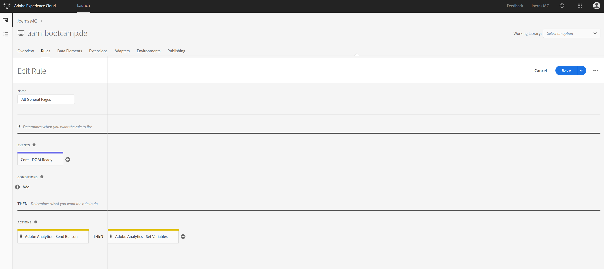
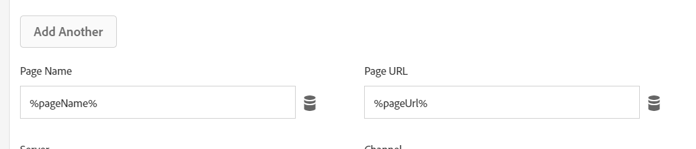

## Exercise 1.4 - Configure Launch Rules

After creating the extensions and data elements, it's time to build our Rules.

Go to [https://launch.adobe.com/](https://launch.adobe.com/) and login with your personal login details.

#### Rule: All General Pages

In the Launch menu, go to Rules and click on "Create New Rule".

Our first rule will fire on All General Pages.
As a name for this rule, let's use "All General Pages".

We need to configure an Event to trigger this rule, so let's click on the + icon to Add an Event.

Our rule should fire on all pages, when the page has completely loaded.

| Extension     | Event Type       | Name             |
|:-------------:| :---------------:| :--------------: |
| Core          | Core - DOM Ready | Core - DOM Ready |

Click "Keep Changes" to save your Event Configuration.

(If you plan on taking a pause here, don't forget to click "Save" to save your changes.)

Now we need to define Actions.

Our first action for this rule will be the configuration of the Adobe Analytics-beacon. 

With the AA-beacon, we're sending page view data directly to Adobe Analytics, which will then forward that data to Audience Manager.

To configure the AA-beacon, you need to add an action to this rule by clicking the + button and by configuring the options as follows:

| Extension                   | Action Type      | Name                                    |
|:---------------------------:| :---------------:| :-------------------------------------: |
| Adobe Analytics             | Set Variables    | Adobe Analytics - Set Variables         |

The following variables need to be configured here:

| Key               | Value             |
|:------------------| :---------------- |
| eVar1             | %pageName%    | 
| eVar2             | %browserAgent%   |
| eVar3             | %pageUrl%        |

| Key               | Value             |
|:------------------| :---------------- |
| Page Name            | %pageName%    | 
| Page URL           | %pageUrl%   |

Click "Keep Changes" to save your Action.

(If you plan on taking a pause here, don't forget to click "Save" to save your changes.)

Our second action for this All General Pages-rule will be the sending of the Adobe Analytics-beacon. 
To send the AA-beacon, you need to add an action to this rule by clicking the + button and by configuring the options as follows:

| Extension                   | Action Type      | Name                                    |
|:---------------------------:| :---------------:| :-------------------------------------: |
| Adobe Analytics             | Send Beacon      | Adobe Analytics - Send Beacon           |

Click "Keep Changes" to save your Action.

Click "Save" to save your Rule Configuration.

With this, you've successfully finished the setup of your Rules in Launch.

Let's do some publishing now!

[Next Step: Exercise 1.5 - Publish Launch Property](./ex5.md)

