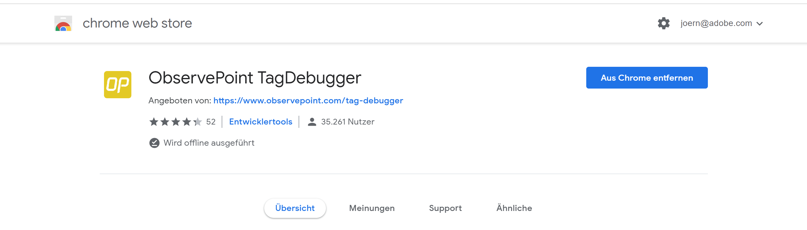
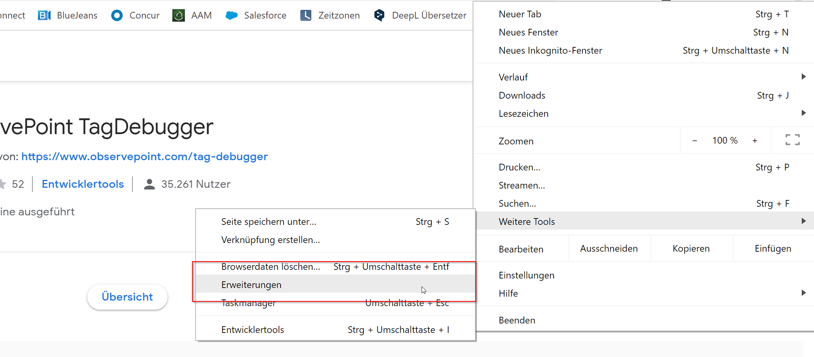
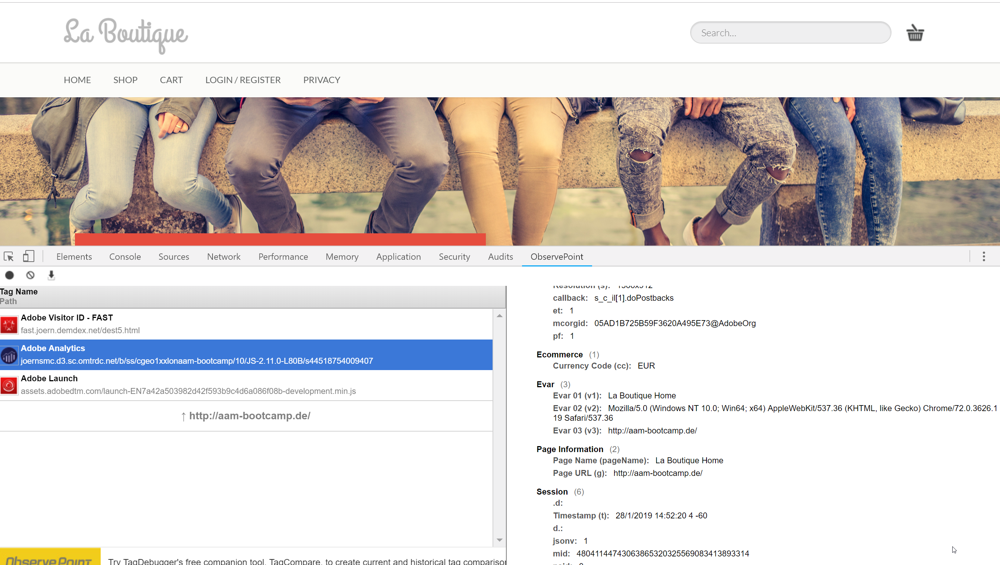
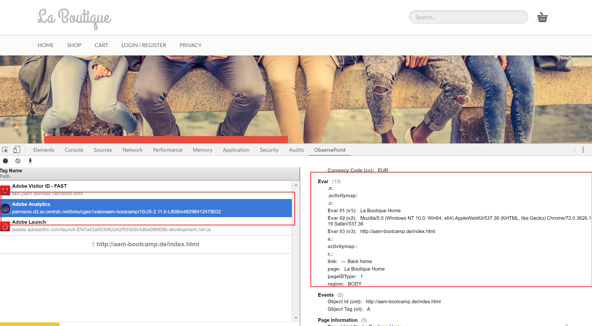

## Exercise 1.7 - Verify Data 

After implementing the Launch Tag on your website, you should start to see calls being sent towards AAM.

To verify if calls are being sent, open your website by going to [http://aam-bootcamp.de](http://aam-bootcamp.de) in Chrome and at the same time open the Chrome Developer Tools.

Open the Chrome Developer Tools on the "Network"-view and then refresh your page.

By refreshing your page, you'll see all the calls being sent from the page to various servers, including the calls from Analytics.

To easily find the calls from Analytics, you can apply a filter by entering "b/ss" in the Filter-field.

This should give you 1 call from AA, which is the call that sends data to AAM.

Now it's time to check our evars that we have created before. Open the "console" tab.

In the textbox type "s.eVar1" and choose from the dropdown menue or hit tab and enter. You should see the value for eVar1 like this.

Repeat the same for eVar2 and eVar3

## Option B: Observe Point ## 

You can also use the Chrome Plugin "ObservePoint" [Download here](https://chrome.google.com/webstore/detail/observepoint-tagdebugger/daejfbkjipkgidckemjjafiomfeabemo?hl=de) to check your eVars directly in the Browser. 

**Don't worry, it is preinstalled on your maschine.** 

Go the "Addons" an check whether it is enalbed or not. 

Go to our website [http://aam-bootcamp.de](http://aam-bootcamp.de) and open developer tools 

Jump to the Observe point menue and refresh the page. Click on the Analytics Icon and check the eVars on the right site. 

**You've finished this exercise! Congratulations!**

### >>> **[Exercise 2 - Build Traits & Segments](../create_traits)** <<<

[Go Back](../README.md)

